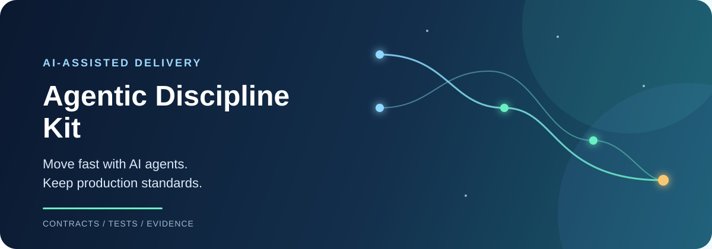

<div align="center">



<h1>Agentic Discipline Kit</h1>

<p><strong>Ship faster with AI agents - without outsourcing engineering judgment to the model.</strong></p>

[](https://github.com/lreyesm1999/agentic-discipline-kit/actions/workflows/ci.yml)
[](https://github.com/lreyesm1999/agentic-discipline-kit/actions/workflows/security.yml)
[](https://www.python.org/)
[](LICENSE)

<p>
  <a href="#60-second-quick-start">Start in 60 seconds</a> ·
  <a href="docs/workflow.md">See the workflow</a> ·
  <a href="docs/adoption.md">Plan adoption</a>
</p>

</div>

Agentic Discipline Kit is a stack-agnostic operating system for AI-assisted software delivery. It gives coding agents a repeatable workflow for requirements, implementation, testing, security, review, and release evidence.

The first public release adds Verification Engineering and Evolution Discipline: measurable claims are
backed by reusable deterministic verifiers, while replacements, temporary artifacts, fallbacks, tests,
and migrations receive explicit lifecycle treatment.

<table>
  <tr>
    <td width="33%"><strong>Protect intent</strong><br>Keep requirements, architecture, and policies traceable.</td>
    <td width="33%"><strong>Prove behavior</strong><br>Turn acceptance, tests, and quality into measurable gates.</td>
    <td width="33%"><strong>Ship evidence</strong><br>Make every release decision reproducible and reviewable.</td>
  </tr>
</table>

## The problem

AI agents are excellent at producing plausible code. Production teams need more than plausible code:

- requirements must remain traceable;
- acceptance behavior must be executable;
- quality gates must measure real metrics;
- security and architecture rules must survive fast changes;
- a release must come with evidence, not confidence.

This kit turns those expectations into contracts, skills, deterministic CLI checks, and CI gates.

## How it works

```mermaid
flowchart LR
    A[Human intent] --> B[Requirements]
    B --> C[Specification]
    C --> D[Acceptance IR]
    D --> E[Plan + risk]
    E --> F[Implementation]
    F --> G[Tests + quality gates]
    G --> H[Security + integrity]
    H --> I[Independent review]
    I --> J[QA + evidence]
    J --> K[Release]
```



Each stage has explicit inputs, outputs, stop conditions, and evidence requirements. If a deterministic tool can measure a claim, the agent must use the tool instead of saying that the code “looks correct.”

## Why teams use it

| Without discipline | With Agentic Discipline Kit |
|---|---|
| “The agent says it is done.” | A release has reproducible evidence. |
| Requirements drift during implementation. | Requirements link to specs, acceptance, tasks, tests, code, and evidence. |
| Tests pass after being weakened. | Integrity checks detect disabled or bypassed gates. |
| Every change gets the same review depth. | Risk classification selects LOW, STANDARD, HIGH, or CRITICAL verification. |
| Security is a late checklist. | Security and architecture are part of the delivery path. |

## 60-second quick start

Download the standalone executable for Windows, macOS, or Linux from
[GitHub Releases](https://github.com/lreyesm1999/agentic-discipline-kit/releases), place it on your
`PATH`, and run this inside your project:

```bash
agentic-discipline init
agentic-discipline doctor --check-tools
```

`init` detects project manifests, supports mixed-stack repositories, installs the contracts, and
generates the quality configuration. If it cannot recognize an ecosystem, it creates a safe generic
configuration that can run commands from any toolchain.

Run the generated project checks:

```bash
agentic-discipline quality --config agentic.config.json
agentic-discipline evidence-verify \
  --ledger artifacts/evidence-ledger.jsonl \
  --check-artifacts
```

For a new project, the same command also installs a canonical `.agentic/` payload. Register and run a
project-specific verifier without learning a new runtime:

```bash
agentic-discipline verifier register checks/my-check
agentic-discipline verifier list
agentic-discipline verify VER-001
agentic-discipline hygiene
```

`verify` produces `PASS`, `FAIL`, `UNKNOWN`, or `BLOCKED` from execution and records normalized evidence;
model narration cannot fabricate a passing result. Use `agentic-discipline adapters sync` to generate
thin, idempotent surfaces for the agent vendors present in a repository.

Python is not required when using a standalone executable. Installing from source remains available
for contributors and requires Python 3.11+:

```bash
python -m pip install -e ".[dev]"
```

Then start your coding agent with the generated `MASTER_PROMPT.md` and follow the lifecycle below.

## The 20 skills

Skills are focused playbooks for the agent. A skill says **when it can run, what it consumes, what it must produce, what it must never do, and what evidence is required**.

```text
01 Requirements intake       11 CRAP analysis
02 Specification              12 Quality gates
03 Acceptance design          13 Differential mutation
04 Acceptance compiler        14 Architecture
05 Task planning              15 Security
06 Risk classification        16 Integrity audit
07 Implementation             17 Independent review
08 Unit testing               18 QA
09 Property testing           19 Release evidence
10 Refactoring                20 Agent retrospective
```

The default lifecycle is:

```text
/spec -> /plan -> /risk -> /build -> /test -> /harden
     -> /review -> /verify -> /release -> /retro
```

The skills solve a common failure mode of AI coding: a fast implementation that quietly drops a requirement, weakens a test, bypasses a gate, or ships without a traceable explanation.

## The current disciplines

The legacy 20 skills remain available for compatibility. New projects additionally receive eleven
canonical disciplines under `.agentic/skills/`: source, specification, acceptance, verification
engineering, coding, cleaning, architecture, hardening, QA, evidence, and evolution. These are thin
portable playbooks; the deterministic core remains independent of Python, TypeScript, .NET, or any
other project stack.

## What you get out of the box

- **Protected contracts** for specs, acceptance, architecture, and policies.
- **Requirement graph**: Requirement -> Spec -> Acceptance -> Task -> Test -> Code -> Evidence.
- **Acceptance IR**: a stack-neutral representation for executable acceptance adapters.
- **Risk-aware verification** with LOW / STANDARD / HIGH / CRITICAL profiles.
- **Metric-aware quality engine** for tests, coverage, lint, format, types, SAST, and repository checks.
- **Property testing** for invariants and edge cases.
- **CRAP analysis** to find complexity hidden behind coverage numbers.
- **Differential mutation testing** for changed critical code.
- **Integrity audit** to detect skipped tests and disabled quality controls.
- **Independent reviewer protocol** to reduce implementation-agent anchoring.
- **Evidence ledger** with SHA-256 hashes and chain verification.
- **Automatic project discovery** with composable profiles and a generic fallback for any toolchain.
- **Standalone binaries, container image, and GitHub Action** so adopters do not manage the CLI runtime.

## A concrete example

Request:

> Add user login.

The kit does not jump straight to code. It turns the request into a controlled change:

```text
Request
  -> acceptance: valid users enter, invalid users fail
  -> risk: authentication is high risk
  -> implementation: smallest coherent slice
  -> tests: unit + properties + acceptance
  -> hardening: security + architecture + integrity
  -> release: QA result + evidence ledger
```

The deliverable is not just a login that works on one happy path. It is a login whose behavior, risk, verification, and release decision can be explained and reproduced.

## CLI highlights

```bash
# Inspect the repository and available tools
agentic-discipline doctor --check-tools

# Compile executable acceptance behavior
agentic-discipline compile-acceptance \
  --input acceptance/checkout.feature \
  --output artifacts/acceptance/checkout.ir.json

# Check requirement completeness and paths
agentic-discipline graph-check \
  --graph artifacts/requirements/checkout.graph.json \
  --complete --check-paths

# Classify change risk and audit protected paths
agentic-discipline risk --base-ref origin/main
agentic-discipline protected --base-ref origin/main
agentic-discipline integrity --base-ref origin/main

# Record and verify release evidence
agentic-discipline evidence \
  --artifact artifacts/quality-report.json \
  --tool pytest \
  --executed-command "pytest --cov" \
  --exit-code 0

agentic-discipline evidence-verify \
  --ledger artifacts/evidence-ledger.jsonl \
  --check-artifacts
```

## Project profiles, not stack limits

The orchestration model and quality runner are command-based and stack-agnostic. Automatic profiles
included out of the box are:

- Python
- TypeScript / JavaScript
- .NET

These profiles are onboarding accelerators, not a compatibility boundary. Unknown ecosystems receive
a generic configuration, and teams can add a data-only profile for Go, Java, Rust, mobile, proprietary
toolchains, or anything else that exposes deterministic commands. Use repeated `--profile` options to
override detection in a mixed project, or `--profile-file` to load a custom descriptor.

## Quality targets

These are starting points, not invented guarantees. Tune them to your risk profile and ratchet legacy systems forward.

| Signal | Suggested target |
|---|---:|
| Line coverage | >= 90% |
| Branch coverage | >= 85% |
| CRAP for changed functions | <= 8 |
| Mutation score | >= 80% |
| Critical mutation survivors | 0 |
| Architecture violations | 0 |
| Critical or high security findings | 0 |

## Repository map

```text
.
├── .github/                 CI, security, release, and contribution automation
├── adapters/                Acceptance adapters by stack
├── config/                  Quality and risk configurations
├── docs/                    Workflow, architecture, security, and adoption guides
├── policies/                Engineering policies enforced by agents
├── schemas/                 Requirement, acceptance, verification, and evidence schemas
├── skills/                  20 agent playbooks
├── agentic/                 Canonical constitution source
├── disciplines/             Canonical discipline source
├── src/agentic_discipline/  Deterministic Python tooling
├── templates/               Specs, acceptance, and release templates
├── tests/                   Framework tests
├── AGENTS.md                Orchestrator contract
└── MASTER_PROMPT.md         Bootstrap prompt for coding agents
```

## When to adopt it

This kit is a strong fit when:

- multiple agents or developers touch the same repository;
- the project has meaningful security, compliance, or architecture constraints;
- you need reproducible release decisions;
- your team wants AI speed without lowering its engineering bar.

For a tiny throwaway script, the full lifecycle may be unnecessary. For a product that matters, the cost of one missed requirement is usually higher than the cost of discipline.

## Documentation

- [Workflow](docs/workflow.md)
- [Architecture](docs/architecture.md)
- [Security model](docs/security-model.md)
- [Adoption guide](docs/adoption.md)
- [Contributing](CONTRIBUTING.md)
- [Security policy](SECURITY.md)
- [Changelog](CHANGELOG.md)

## Project status

**v1.0.0 - Production/Stable.** The deterministic core validates contracts, executes reusable verifiers, preserves evidence hashes, supports portable adapters, and includes compatibility migration for the pre-public v2.1 workflow.

## License

MIT License. See [LICENSE](LICENSE).
