<div align="center">


<h1>Agentic Discipline Kit</h1>

<p><strong>Ship faster with AI agents — without outsourcing engineering judgment to the model.</strong></p>

[](https://www.npmjs.com/package/agentic-discipline)
[](https://pypi.org/project/agentic-discipline-kit/)
[](https://github.com/lreyesm1999/agentic-discipline-kit/actions/workflows/ci.yml)
[](https://github.com/lreyesm1999/agentic-discipline-kit/actions/workflows/security.yml)
[](https://www.python.org/)
[](LICENSE)

<p>
  <a href="#quick-start">Quick Start</a> ·
  <a href="#core-capabilities">Capabilities</a> ·
  <a href="#the-12-engineering-disciplines">12 Disciplines</a> ·
  <a href="#control-plane--assurance-engine">Control Plane & Assurance</a> ·
  <a href="docs/install.md">Installation Guide</a> ·
  <a href="docs/workflow.md">Workflow</a>
</p>

</div>

---

**Agentic Discipline Kit (ADK)** is a stack-agnostic operating system for AI-assisted software delivery. It provides coding agents with an enforceable, deterministic workflow covering requirements intake, specification, test-driven implementation, differential mutation, security, independent review, and immutable release evidence.

Instead of scattering ad-hoc prompt files or trusting model self-attestation, ADK installs once into whatever coding assistants your team already uses (Claude Code, Cursor, Copilot, Windsurf, etc.), stores configuration centrally in `.agentic/`, and backs every milestone with reproducible verifiers.

<table>
  <tr>
    <td width="33%"><strong>1. Protect Intent</strong><br>Keep requirements, architecture boundaries, and governance policies traceable through every diff.</td>
    <td width="33%"><strong>2. Prove Behavior</strong><br>Turn acceptance criteria, property tests, and quality standards into deterministic execution gates.</td>
    <td width="33%"><strong>3. Ship Evidence</strong><br>Anchor release decisions to cryptographic evidence ledgers, not model narration.</td>
  </tr>
</table>

---

## The Problem It Solves

AI agents generate plausible code rapidly. However, production systems require more than plausibility:

| Without Discipline | With Agentic Discipline Kit |
|---|---|
| “The model says the feature is done.” | Release decisions are backed by cryptographic, reproducible tool evidence. |
| Requirements quietly drift during iterative prompting. | Unbroken traceability graph: Requirement $\to$ Spec $\to$ Acceptance IR $\to$ Task $\to$ Test $\to$ Code $\to$ Evidence. |
| Agents secretly weaken or delete failing tests. | Tamper-proof integrity audits detect bypassed, relaxed, or deleted gates. |
| Every change receives identical, superficial review. | Risk classification (LOW, STANDARD, HIGH, CRITICAL) mandates proportionate hardening. |
| Security and architecture are afterthoughts. | Protected contracts, bounded scopes, and static policies are enforced before coding begins. |

---

## Quick Start

### 1. Initialize in 60 Seconds

Run one command in your project root:

```bash
npx agentic-discipline init
```

*Prefer Python tooling?*
```bash
pipx install agentic-discipline-kit
agentic-discipline init
```

*Using Claude Code?*
```text
/plugin marketplace add lreyesm1999/agentic-discipline-kit
/plugin install agentic-discipline@agentic-discipline-kit
```

### 2. What Gets Generated

Your repository root remains clean:

```text
AGENTS.md              Orchestrator contract read by Codex, Zed, Cline, Aider, Jules, etc.
agentic.config.json    Quality gates tailored to your detected toolchain.
.agentic/              Payload, schemas, playbooks, and local control plane state.
```

### 3. Ask Your Agent to Work

Simply state your business intent in natural language:

```text
Implement a reservation cancellation policy API with refund calculation.
```

**Zero-touch workflow behind the scenes:**
1. **Preflight & Readiness:** The agent verifies that the project environment is healthy.
2. **Contract Derivation:** Translates your intent into a bounded task contract without inventing details.
3. **Execution & Checkpoints:** Governs local work, captures state checkpoints at risk boundaries, and executes verified gates.
4. **Completion Guarantee:** Halts and seeks human approval for genuinely human decisions (e.g. protected contracts, missing business scope, CRITICAL risk).

---

## How It Works

```mermaid
flowchart LR
    A[Human Intent] --> B[Requirements Intake]
    B --> C[Specification]
    C --> D[Acceptance IR]
    D --> E[Task Plan & Risk]
    E --> F[Test-Driven Build]
    F --> G[Quality Gates]
    G --> H[Security & Hardening]
    H --> I[Independent Review]
    I --> J[Evidence Ledger]
    J --> K[Release Ready]
```



Each stage operates with explicit contracts, stop conditions, and deterministic verification. An agent cannot declare a stage passed unless the underlying tool exits cleanly (`exit 0`).

---

## Core Capabilities

- **Protected Path Contracts:** Prevents unauthorized agent tampering with `/specs`, `/acceptance`, `/architecture`, `/policies`, and `.github/workflows`.
- **Requirement Traceability Graph:** Cryptographically tracks requirements through specs, acceptance criteria, test execution, and final release artifacts.
- **Acceptance IR:** Universal, stack-neutral intermediate representation compiled to test runners across Python, TypeScript, .NET, and generic toolchains.
- **Risk-Tiered Governance:**
  - `LOW`: Focused unit tests, linting, build checks.
  - `STANDARD`: Acceptance tests, integration, coverage, complexity (CRAP), security, integrity audit.
  - `HIGH`: Property testing, differential mutation, isolated independent review, black-box QA.
  - `CRITICAL`: Full mutation scope, mandatory human sign-off, zero survivors, finalized ledger.
- **Differential Mutation Testing:** Evaluates test suite quality on changed code using AST-driven equivalents and deterministic kill verification.
- **Automated Anti-Tampering Audit:** Inspects git history to catch disabled tests, commented-out assertions, or lowered thresholds.
- **Independent Reviewer Isolation:** Provides fresh review context containing only specifications, diffs, and evidence — eliminating persuasion bias from coding agents.

---

## The 12 Engineering Disciplines

ADK compiles 12 focused engineering disciplines directly into the native instruction formats of your agents:

```text
01 Source            07 Architecture
02 Specification     08 Hardening
03 Acceptance        09 QA
04 Verification      10 Evidence
05 Coding            11 Evolution
06 Cleaning          12 Autonomous Project Execution
```

Supported agent platforms:

| Assistant / IDE | Native Surface Emitted |
|---|---|
| **Claude Code** | `.claude/skills/agentic-*/SKILL.md` + slash commands (`/spec`, `/build`, `/verify`, `/retro`) |
| **Cursor** | `.cursor/rules/agentic-*.mdc` (scoped by glob patterns) |
| **GitHub Copilot** | `.github/instructions/agentic-*.instructions.md` |
| **Windsurf** | `.windsurf/rules/agentic-*.md` |
| **Antigravity** | `.agents/skills/agentic-*/SKILL.md` |
| **Gemini CLI** | `GEMINI.md` |
| **Codex, Zed, Cline, Aider** | Canonical `AGENTS.md` orchestrator |
| **ChatGPT** | Single-bundle prompt payload for Projects and Custom GPTs |

---

## Control Plane & Assurance Engine

Starting with **v2.0** and **v2.1**, ADK embeds an autonomous local control plane (`agentic`) into your repository:

### 1. Local Control Plane (`v2.0`)
- **State Database:** Serverless SQLite WAL store under `.agentic/control/state.db` tracking tasks, leases, claims, and timeline events.
- **Atomic Workspaces:** Isolated working trees for concurrent task execution without race conditions.
- **Checkpointing:** Captures verifiable hypotheses, modified files, and test results at critical junctures.
- **Local Console & MCP:** Native Model Context Protocol (MCP) server for inspection tools and localhost console.

### 2. Adaptive Assurance Engine (`v2.1`)
- **Proof Obligations:** Every change generates structured proof obligations based on risk and repository policy.
- **Freshness & Invalidation:** Obligations stale automatically when their underlying code or input dependencies move.
- **Refusal on Incompleteness:** Tasks cannot complete while any obligation remains `FAILED`, `UNKNOWN`, `BLOCKED`, `STALE`, or `HUMAN_REQUIRED`.

```bash
# Inspect task assurance status
agentic assurance status TASK-104

# Compile and plan proof routes
agentic assurance plan TASK-104 --compile
```

```text
TASK-104 ASSURANCE
  Required obligations 12
  FAILED                 0
  HUMAN_REQUIRED         0
  UNKNOWN                0
  VERIFIED              12
  Proof debt             0
  Decision            COMPLETE
```

---

## CLI Reference Highlights

```bash
# 1. Health and execution readiness
agentic-discipline doctor --check-tools
agentic doctor

# 2. Compile and validate acceptance contracts
agentic-discipline compile-acceptance \
  --input acceptance/checkout.feature \
  --output artifacts/acceptance/checkout.ir.json

# 3. Classify risk, audit protected contracts and anti-tampering
agentic-discipline risk --base-ref origin/main
agentic-discipline protected --base-ref origin/main
agentic-discipline integrity --base-ref origin/main

# 4. Enforce quality gates
agentic-discipline quality --config agentic.config.json

# 5. Record and cryptographically verify evidence
agentic-discipline evidence \
  --artifact artifacts/quality-report.json \
  --tool pytest \
  --executed-command "pytest --cov" \
  --exit-code 0

agentic-discipline evidence-verify \
  --ledger artifacts/evidence-ledger.jsonl \
  --check-artifacts
```

---

## Supported Ecosystems

The orchestration model and quality runner are command-based and stack-agnostic. Out of the box, ADK includes automated detection profiles for:

- **Python** (pytest, ruff, mypy, bandit, mutmut)
- **TypeScript / JavaScript** (vitest, jest, eslint, tsc, npm audit)
- **.NET** (dotnet test, roslyn analyzers)
- **Generic / Custom**: Define command-based quality gates for Go, Rust, Java, C++, Mobile, or internal platforms.

---

## Suggested Quality Targets

| Metric / Gate | Standard Target | Critical Target |
|---|---|---|
| Line Coverage | $\ge 90\%$ | $\ge 95\%$ |
| Branch Coverage | $\ge 85\%$ | $\ge 90\%$ |
| CRAP Score | $\le 8$ | $\le 4$ |
| Mutation Score | $\ge 80\%$ | $100\%$ |
| Mutation Survivors | 0 unresolved | 0 unresolved |
| Security Vulnerabilities | 0 High/Critical | 0 High/Critical/Medium |
| Architecture Policy Violations | 0 | 0 |
| Gate Tampering Findings | 0 | 0 |

---

## Documentation Map

- **Getting Started:** [Installation Guide](docs/install.md) · [Workflow Lifecycle](docs/workflow.md) · [Adoption Plan](docs/adoption.md)
- **Technical Specs:** [CLI Reference](docs/cli.md) · [Architecture Overview](docs/architecture.md) · [Security & Trust Model](docs/security-model.md)
- **Control Plane & v2.1:** [Control Plane Guide (v2.0)](docs/v2/README.md) · [Assurance Engine (v2.1)](docs/v2.1/README.md) · [Validation Evidence](docs/v2.1/VALIDATION.md) · [Implementation Status](docs/IMPLEMENTATION_STATUS.md)
- **Project Governance:** [Contributing](CONTRIBUTING.md) · [Changelog](CHANGELOG.md) · [Security Policy](SECURITY.md)

---

## Project Status

**v2.1.0 — Production / Stable.** Includes the full deterministic quality core, multi-agent instruction compiler, zero-touch bootstrap, local control plane, and the Adaptive Assurance Engine.

## License

MIT License. See [LICENSE](LICENSE) for details.
