<div align="center">


<h1>Agentic Discipline Kit</h1>

<p><strong>Ship faster with AI agents - without outsourcing engineering judgment to the model.</strong></p>

[](https://www.npmjs.com/package/agentic-discipline)
[](https://pypi.org/project/agentic-discipline-kit/)
[](https://github.com/lreyesm1999/agentic-discipline-kit/actions/workflows/ci.yml)
[](https://github.com/lreyesm1999/agentic-discipline-kit/actions/workflows/security.yml)
[](https://www.python.org/)
[](LICENSE)

<p>
  <a href="#60-second-quick-start">Start in 60 seconds</a> ·
  <a href="docs/install.md">Install guide</a> ·
  <a href="docs/workflow.md">See the workflow</a> ·
  <a href="docs/adoption.md">Plan adoption</a>
</p>

</div>

Agentic Discipline Kit is a stack-agnostic operating system for AI-assisted software delivery. It gives coding agents a repeatable workflow for requirements, implementation, testing, security, review, and release evidence.

It installs with one command into whichever agent tools a repository already uses, keeps its payload
in `.agentic/` instead of scattering files through the project root, and backs measurable claims with
reusable deterministic verifiers rather than model narration.

<table>
  <tr>
    <td width="33%"><strong>Protect intent</strong><br>Keep requirements, architecture, and policies traceable.</td>
    <td width="33%"><strong>Prove behavior</strong><br>Turn acceptance, tests, and quality into measurable gates.</td>
    <td width="33%"><strong>Ship evidence</strong><br>Make every release decision reproducible and reviewable.</td>
  </tr>
</table>

## The problem

AI agents are excellent at producing plausible code. Production teams need more than plausible code:

- requirements must remain traceable;
- acceptance behavior must be executable;
- quality gates must measure real metrics;
- security and architecture rules must survive fast changes;
- a release must come with evidence, not confidence.

This kit turns those expectations into contracts, skills, deterministic CLI checks, and CI gates.

## How it works

```mermaid
flowchart LR
    A[Human intent] --> B[Requirements]
    B --> C[Specification]
    C --> D[Acceptance IR]
    D --> E[Plan + risk]
    E --> F[Implementation]
    F --> G[Tests + quality gates]
    G --> H[Security + integrity]
    H --> I[Independent review]
    I --> J[QA + evidence]
    J --> K[Release]
```



Each stage has explicit inputs, outputs, stop conditions, and evidence requirements. If a deterministic tool can measure a claim, the agent must use the tool instead of saying that the code “looks correct.”

## Why teams use it

| Without discipline | With Agentic Discipline Kit |
|---|---|
| “The agent says it is done.” | A release has reproducible evidence. |
| Requirements drift during implementation. | Requirements link to specs, acceptance, tasks, tests, code, and evidence. |
| Tests pass after being weakened. | Integrity checks detect disabled or bypassed gates. |
| Every change gets the same review depth. | Risk classification selects LOW, STANDARD, HIGH, or CRITICAL verification. |
| Security is a late checklist. | Security and architecture are part of the delivery path. |

## 60-second quick start

```bash
npx agentic-discipline init
```

That is the whole install. It detects the agent tools your repository already
uses and writes each one's native format - Claude Code skills, Cursor rules,
Copilot instructions, Windsurf rules, `AGENTS.md` for everything that reads it -
all compiled from one canonical source so they cannot drift apart.

Two files appear in your repository root:

```text
AGENTS.md              read by Codex, Zed, Cline, Aider, Jules and others
agentic.config.json    quality gates, generated for your detected stack
.agentic/              everything else, the way tooling belongs in .github/
```

Preview before writing anything with `--dry-run`, and check the result with
`agentic-discipline doctor --check-tools`.

Using Claude Code? Install it as a plugin instead, and get the lifecycle as
slash commands:

```text
/plugin marketplace add lreyesm1999/agentic-discipline-kit
/plugin install agentic-discipline@agentic-discipline-kit
```

The deterministic gates are a separate, optional install - you only need them
when you want to run checks rather than guide an agent:

```bash
pipx install agentic-discipline-kit
```

Then:

```bash
agentic-discipline quality --config agentic.config.json
agentic-discipline verify VER-001
agentic-discipline evidence-verify --ledger artifacts/evidence-ledger.jsonl --check-artifacts
```

`verify` produces `PASS`, `FAIL`, `UNKNOWN` or `BLOCKED` from execution and records
normalized evidence; model narration cannot fabricate a passing result.

Full matrix, per-tool details and the ChatGPT bundle: [Install guide](docs/install.md).

## Works with the tools you already use

| Tool | Receives |
|---|---|
| Claude Code | `.claude/skills/agentic-*/SKILL.md`, or the plugin with `/spec` to `/retro` |
| Cursor | `.cursor/rules/agentic-*.mdc`, scoped by `globs` |
| GitHub Copilot | `.github/instructions/agentic-*.instructions.md`, scoped by `applyTo` |
| Windsurf | `.windsurf/rules/agentic-*.md`, with trigger modes |
| Antigravity | `.agents/skills/agentic-*/SKILL.md` |
| Gemini CLI | `GEMINI.md` |
| Codex, Zed, Cline, Aider, Jules | `AGENTS.md` |
| ChatGPT | a paste-ready bundle for Projects and Custom GPTs |

Each surface is emitted in the format that tool actually loads, not the same
file under a different extension, so selective activation works: the coding
discipline loads when code changes, hardening when tests do.

## The 12 disciplines

A discipline is a focused playbook that says **when it applies, what it consumes,
what it must produce, what it must never do, and what evidence is required**.
These are what get installed into your agent tools:

```text
01 Source            07 Architecture
02 Specification     08 Hardening
03 Acceptance        09 QA
04 Verification      10 Evidence
05 Coding            11 Evolution
06 Cleaning          12 Autonomous Project Execution
```

Each one carries the activation metadata its host tool needs, so it loads when
it is relevant rather than sitting in a folder the agent never reads.

The default lifecycle is:

```text
/spec -> /plan -> /risk -> /build -> /test -> /harden
     -> /review -> /verify -> /release -> /retro
```

The Claude Code plugin ships these as slash commands. In other tools they are
the phases the disciplines refer to.

Behind the disciplines sit 20 detailed workflow playbooks - requirements intake,
CRAP analysis, differential mutation, integrity audit, independent review and
the rest. `init` installs them to `.agentic/playbooks/` as reference material
the disciplines cite; they are not separate skills competing for the agent's
attention.

### Execute a plan with minimal supervision

`agentic-autonomous-project-execution` coordinates the lifecycle across tasks. It
inspects existing work, follows the documented dependency order, implements and
verifies each slice, updates the project tracker, and continues while authorized
work remains. A blocked integration does not stop independent local work.

After installing the kit, a project prompt can be as short as:

```text
Read the specification, use agentic-autonomous-project-execution, and execute
the plan in its documented order.
```

En español:

```text
Lee la especificación, usa agentic-autonomous-project-execution y ejecuta el
plan siguiendo el orden documentado.
```

The name retains the kit's `agentic-` prefix. In the Claude Code plugin, use
`/agentic-discipline:execute <plan path or scope>`; other tools load the discipline
through their generated rules or `AGENTS.md` index. This is an instruction skill,
not a background worker: it operates during the agent's available execution and
records a checkpoint when an objective limit prevents continuing.

The skill asks for human input only after finishing independent work, with the
exact missing decision or access. It preserves existing authorization, protected
contracts, and required verification. It does not turn planning-only requests into
implementation, invent product behavior, or treat unverified work as complete.

Existing projects receive it after updating the kit and running
`agentic-discipline adapters sync --project-root <project>` (add `--adapter <tool>`
for an explicitly selected tool). The installable artifacts gain this addition in
the next release; the repository source contains it immediately after merge.

Together they solve a common failure mode of AI coding: a fast implementation
that quietly drops a requirement, weakens a test, bypasses a gate, or ships
without a traceable explanation.

## What you get out of the box

- **Protected contracts** for specs, acceptance, architecture, and policies.
- **Requirement graph**: Requirement -> Spec -> Acceptance -> Task -> Test -> Code -> Evidence.
- **Acceptance IR**: a stack-neutral representation for executable acceptance adapters.
- **Risk-aware verification** with LOW / STANDARD / HIGH / CRITICAL profiles.
- **Metric-aware quality engine** for tests, coverage, lint, format, types, SAST, and repository checks.
- **Property testing** for invariants and edge cases.
- **CRAP analysis** to find complexity hidden behind coverage numbers.
- **Differential mutation testing** for changed critical code.
- **Integrity audit** to detect skipped tests and disabled quality controls.
- **Independent reviewer protocol** to reduce implementation-agent anchoring.
- **Evidence ledger** with SHA-256 hashes and chain verification.
- **Automatic project discovery** with composable profiles and a generic fallback for any toolchain.
- **A multi-tool skill compiler** that emits Claude Code, Cursor, Copilot, Windsurf, Antigravity, Gemini and `AGENTS.md` surfaces from one canonical source.
- **Honest generated gates**: a gate whose command cannot run here is written non-blocking with the reason, never silently enabled.
- **An npm launcher, a Claude Code plugin, a PyPI package, standalone binaries, a GitHub Action, and a Dockerfile** so adopters do not manage the CLI runtime.

## A concrete example

Request:

> Add user login.

The kit does not jump straight to code. It turns the request into a controlled change:

```text
Request
  -> acceptance: valid users enter, invalid users fail
  -> risk: authentication is high risk
  -> implementation: smallest coherent slice
  -> tests: unit + properties + acceptance
  -> hardening: security + architecture + integrity
  -> release: QA result + evidence ledger
```

The deliverable is not just a login that works on one happy path. It is a login whose behavior, risk, verification, and release decision can be explained and reproduced.

## CLI highlights

```bash
# Inspect the repository and available tools
agentic-discipline doctor --check-tools

# Compile executable acceptance behavior
agentic-discipline compile-acceptance \
  --input acceptance/checkout.feature \
  --output artifacts/acceptance/checkout.ir.json

# Check requirement completeness and paths
agentic-discipline graph-check \
  --graph artifacts/requirements/checkout.graph.json \
  --complete --check-paths

# Classify change risk and audit protected paths
agentic-discipline risk --base-ref origin/main
agentic-discipline protected --base-ref origin/main
agentic-discipline integrity --base-ref origin/main

# Record and verify release evidence
agentic-discipline evidence \
  --artifact artifacts/quality-report.json \
  --tool pytest \
  --executed-command "pytest --cov" \
  --exit-code 0

agentic-discipline evidence-verify \
  --ledger artifacts/evidence-ledger.jsonl \
  --check-artifacts
```

## Project profiles, not stack limits

The orchestration model and quality runner are command-based and stack-agnostic. Automatic profiles
included out of the box are:

- Python
- TypeScript / JavaScript
- .NET

These profiles are onboarding accelerators, not a compatibility boundary. Unknown ecosystems receive
a generic configuration, and teams can add a data-only profile for Go, Java, Rust, mobile, proprietary
toolchains, or anything else that exposes deterministic commands. Use repeated `--profile` options to
override detection in a mixed project, or `--profile-file` to load a custom descriptor.

## Quality targets

These are starting points, not invented guarantees. Tune them to your risk profile and ratchet legacy systems forward.

| Signal | Suggested target |
|---|---:|
| Line coverage | >= 90% |
| Branch coverage | >= 85% |
| CRAP for changed functions | <= 8 |
| Mutation score | >= 80% |
| Critical mutation survivors | 0 |
| Architecture violations | 0 |
| Critical or high security findings | 0 |

## Repository map

```text
.
├── .claude-plugin/          Claude Code marketplace manifest
├── .github/                 CI, security, release, and contribution automation
├── adapters/                Acceptance adapters by stack
├── agentic/                 Canonical constitution source
├── config/                  Quality profiles and risk configuration
├── disciplines/             Canonical discipline source - every surface compiles from here
├── docs/                    Install, workflow, architecture, security, adoption
├── packaging/               npm launcher, Claude Code plugin, standalone build spec
├── policies/                Engineering policies enforced by agents
├── schemas/                 Requirement, acceptance, verification, and evidence schemas
├── skills/                  20 detailed workflow playbooks
├── src/agentic_discipline/  Deterministic Python tooling
├── templates/               Specs, acceptance, and release templates
├── tests/                   Framework tests
├── AGENTS.md                Orchestrator contract
└── MASTER_PROMPT.md         Bootstrap prompt for coding agents
```

`packaging/claude-plugin/` is generated from `disciplines/`, never edited by
hand; a test fails the build if the committed copy falls behind.

## When to adopt it

This kit is a strong fit when:

- multiple agents or developers touch the same repository;
- the project has meaningful security, compliance, or architecture constraints;
- you need reproducible release decisions;
- your team wants AI speed without lowering its engineering bar.

For a tiny throwaway script, the full lifecycle may be unnecessary. For a product that matters, the cost of one missed requirement is usually higher than the cost of discipline.

## Agentic Discipline 2 preview

The new `agentic` CLI adds persistent project knowledge, task contracts, cross-agent
checkpoints, Git workspaces, current verification evidence, MCP and a local console.
See the [preview guide](docs/v2/README.md) and [implementation status](docs/IMPLEMENTATION_STATUS.md).
The published v1 command and adapters remain available; this branch does not publish a 2.0 release.

## Documentation

- [Install guide](docs/install.md)
- [Workflow](docs/workflow.md)
- [Architecture](docs/architecture.md)
- [Security model](docs/security-model.md)
- [Adoption guide](docs/adoption.md)
- [Internal payload migration](docs/payload-migration.md)
- [Contributing](CONTRIBUTING.md)
- [Security policy](SECURITY.md)
- [Changelog](CHANGELOG.md)

## Project status

**v1.1.0 - Production/Stable.** The deterministic core validates contracts, executes reusable verifiers, preserves evidence hashes, and compiles one canonical discipline set into every supported agent tool. Installations from earlier versions should run `agentic-discipline migrate --to 3.0` to move the payload under `.agentic/`.

## License

MIT License. See [LICENSE](LICENSE).
